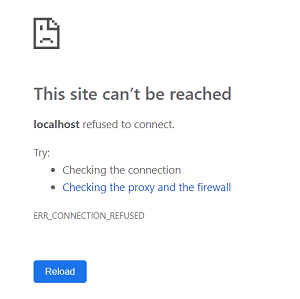

## *nix Server OneDrive Client


This application will allow you to automate backing up directories from a [*nix-based](https://en.wikipedia.org/wiki/Unix-like) server to your OneDrive cloud storage. The primary application of this is creating an off-premise cloud backup using your OneDrive service for critical directories such as a Git remote.

 |
------------ | 
_Concept_ | 

It takes a list of mappings of directories on the server that are uploaded to the specified directory/directories in OneDrive. The server directory is compressed into `.tar.gz` format before being uploaded. 

 |
------------ | 
_Illustrating the possible many-to-many mapping of server to OneDrive directories_ |

### Why?

You might be wondering if this is relevant with several Linux OneDrive clients available including [ExpanDrive](https://www.expandrive.com/onedrive-for-linux/) and [skilion's OneDrive client](https://github.com/skilion/onedrive).

1. The purpose of this is to create snapshots - not a dynamic, real-time backup that normal two-way sync clients provide
2. With this you are able to control the frequency and timing of your backups, as well as the total size of all backups in your cloud storage
3. Some clients require a GUI - which a server sometimes does not have
4. Setup instructions include registering your own Microsoft application - which means you have full control over your own data

A possible plus or minus:

* Application is written in Python, environment scripts are written in Bash, scheduling is done via [cron](https://en.wikipedia.org/wiki/Cron)

### This Guide

This README is more of a guide and includes instructions on everything from setting up your Microsoft project, to setting up the Python application and setting up the cron jobs on your server.

It consists of the following parts:

- Using the Microsoft application registration portal to set up your OneDrive service API
- Setting up the Python application that utilizes the API
- Setting up the cronjobs that can be run on a *nix-based server to execute the Python application at a given interval

Note that this guide assumes you are using a cron scheduler but theoretically you could run this from any machine as long as it has a scheduler and can run Python. In this case we would normally call this machine the 'server' but actually the way it's applied here it's more of a client from how it will be interacting with Microsoft's service API.

What you will need:
- A machine with a scheduler that can run Python - ideally with 24/7 availability
- Access to a Microsoft account for creating the application
- Access to the Microsoft account with OneDrive storage provisioned (this can be the same as the account used to create the application)

### Create Microsoft Application

Old instructions using Microsoft's app registration portal can be found [here](old_msapp_instructions.md) 

In order to use Microsoft's services API which is referred to as Microsoft Graph, you will need to use your account to register an application. To do so, go to Azure portal:

https://portal.azure.com

Once you've signed in, use the search bar to find app registrations:

 |
------------ | 
_Navigating to app registration portal_ |

Click on "New registration".

Name the app something like `nix-server-onedrive-client`. Leave the default option for supported account types. Use the following as the redirect URI: `http://localhost:8000/nix-server-onedrive-client/callback`

 |
------------ | 
_Creating a new application_ |

Click on "Register".

The first thing you'll need is the client ID for the app. You can find this in the "Overview" section. Click on the copy to clipboard icon to save it. When configuring the Python application this will be used as the `client_id`.

 |
------------ | 
_Saving the client ID_ |

Next you want to generate a new client secret. Go to "Certificates & secrets" and in the "Client secrets" section click on "New client secret": 

 |
------------ | 
_Generating a client secret_ |

You can leave the description field empty. Choose any expiry length, then click "Add". 

Once the secret is generated, click on the copy to clipboard icon and be sure to save it as you won't be able to copy it again! When you're configuring the Python app later, this will be used as the `client_secret`.

 |
------------ | 
_Saving the client secret_ |

### Set up Python Application

This section describes how to set up your environment to run the Python application, including pulling the code, installing necessary tools and dependencies, getting your API token and configuring the app.

#### Clone repository

Make sure you're in the directory where you want to run the Python application and Cronjob from. The rest of these steps will denote the current directory by `<path>`

```
$ git clone https://github.com/masonpimentel/nix-server-onedrive-client.git
```

Alternatively, if you want to use SSH:

```
$ git clone git@github.com:masonpimentel/nix-server-onedrive-client.git
```

#### Install relevant tools

To run the Python application you will need to install Python as well as some dependencies.

##### Python

The steps you take to install Python largely depends on the OS or distribution you're using. Chances are you already have Python installed or it was there by default. **The most important thing is that you have Python 3** (not Python 2). You will also need [pip](https://en.wikipedia.org/wiki/Pip_(package_manager)) for Python 3. Here are the steps for installing from the Python docs:

https://docs.python-guide.org/starting/install3/linux/

If you decided to go with Ubuntu 18.04 server, Python 3 is already installed but pip can be installed using the following:

```
$ sudo apt install python3-pip
``` 

Check your Python version using the `-V` argument:

```
$ python3 -V
Python 3.6.5
```

Note that for the particular Ubuntu server version `python3` is used to invoke Python 3, `python` runs Python 2. Similarly for pip, `pip3` is used to invoke the package manager for Python 3.

Check that `pip3` is set up correctly:

```
$ pip3 -V
pip 9.0.1 from /usr/lib/python3/dist-packages (python 3.6)
```

##### Dependencies

Run the following to install the necessary Python packages:

```
$ pip3 install filesplit requests
```

Run the following (on Ubuntu at least) to install `jq`:

```
$ sudo apt install jq
```

##### Setting up Python invoker

Now that we know what our Python invoker is (in the case above, it is `python3`) we need to configure the app to use this. To do so, run:

```
$ ./config <Python invoker>
```

For the example above, it would be:

```
$ cd <path>/nix-server-onedrive-client
$ ./config python3
```

#### Complete configuration JSON

For running the app, the only configuration file that needs to be modified is the `user_config.json` file. `dev_config.json` contains all the configuration values that would be modified for development purposes only. 

##### Required fields

* `client_id` - you should have this from the `Create Microsoft Application` section
* `client_secret` - you should also have this from the `Create Microsoft Application` section
* `upload_pairs` - these are the mappings for the directory on your server that will be uploaded in `.tar.gz` format to the directory in your OneDrive storage. It is an array so you can add as many mappings as you wish. The array expects objects with a `local_dir` string property which should be an absolute path specifying the local directory that will be backed up, and `server_dir` string property which should be an absolute path specifying the directory in your OneDrive storage in which the tar will be placed. You can add an optional `server_max_size` property which is an integer that specifies the maximum size for the OneDrive directory in bytes. If the OneDrive directory in the mapping reaches this limit, the oldest files will be deleted to maintain the size. Note that if multiple pairs map to the same OneDrive directory, the smallest `server_max_size` will be used, but sequentially (meaning that size will be honored at the time that mapping's `local_dir` is uploaded to the `server_dir`) 
```
    [
        {
            "local_dir": "/absolute/path/to/directory/on/server",
            "server_dir" "absolute/path/to/directory/in/OneDrive/storage"
        },
        {
            "local_dir": "/another/absolute/path/to/directory/on/server",
            "server_dir": "another/absolute/path/to/directory/in/OneDrive/storage",
            "server_max_size": 5368709120
        },
        ...
    ]
```
This can be a many-to-many mapping, meaning you can backup the same directory to multiple OneDrive directories, and vice-versa - you can backup multiple directories to the same OneDrive directory
* `backup_max_size` - this is the fallback maximum size for all OneDrive upload directories. See `upload_pairs` above. If a directory doesn't have a specified `server_max_size` then this is the value that will be used instead. Just like the `server_max_size` - if a OneDrive directory reaches this limit, the oldest files will be deleted to maintain the size. It is set by default to 10 GB - change this to the desired size (in bytes)
* `verbosity` - turn on `verbose` to see more log output. It is set to `true` by default. `debug` is more for development purposes

#### Configure token

We will now use our credentials to get our API token for sending requests to our application. This will also configure your refresh token so that the app will be able to retrieve future tokens on its own - you will only need to do the manual steps described here once.

Run the `config` script with no arguments:

```
$ cd <path>/nix-server-onedrive-client
$ ./config
```

 |
------------ | 
_Configuration prompt_ |

As explained in the console output, go to the displayed url in any browser on any device.

When you do so, note that if your browser remembers your Microsoft login information you will not be shown a login prompt - you will be shown a page load error in your browser. This is expected.

 |
------------ | 
_Unable to connect to localhost port_ |

Otherwise, you will then be prompted to login to your Microsoft account using their login portal (see the url and certificate). Go ahead and login to your account with OneDrive provisioned (this may or may not be the same as the one you used to create the Microsoft application).

 |
------------ | 
_Using Microsoft's login portal to get an auth code_ |

 |
------------ | 
_Double checking you're in the right place!_ |

Once complete, as explained earlier, you will be redirected to a localhost address which will not load a page. However, the auth code you need will be in the url. See your browser's address in the url bar, and copy everything after `'code='` 

 |
------------ | 
_Getting the auth code from your browser's url_ |

This is the value you will need to enter in the console prompt.

 |
------------ | 
_App and token successfully configured_ |

NOTE: recently (July 16, 2019) it's been observed that certain `client_id` and `client_secret` pairs just don't work - see https://github.com/masonpimentel/nix-server-onedrive-client/issues/16

The current workaround is to just try again with a new application (use the steps in the `Clear configuration` section just below, and repeat the steps from the `Create Microsoft Application` section)

##### Clear configuration

If for any reason you need to clear your configuration, you can run the following:

```
$ cd <path>/nix-server-onedrive-client
$ ./config clear
```

This will clear our your client ID and client secret in `user_config.json` as well as your refresh token in `dev_config.json`. Re-run the config script to re-configure the app.

### Using the App

This section describes how to manually execute the app (the last section explains how to set it up to run automatically) and view the execution logs.

#### Running for the First Time

You can make a manual run by running:

```
$ cd <path>/nix-server-onedrive-client
$ ./cronjob &
```

#### Viewing Logs

To see the logs, open `<path>/nix-server-onedrive-client/output.txt` This can be done by running:

```
$ cat <path>/nix-server-onedrive-client/output.txt
```

 |
------------ | 
_Viewing the logs_ |

Here you can see:

* The directories are archived into `tar.gz` format, named as `<epoch>_<timedate>_<directory>.tar.gz`, done by the cronjob
* A temporary directory is created for the archives, also done by the cronjob
* The cronjob starts up the upload Python script
* OneDrive has an upload partition limit size of 60MB so the Python upload script handles partitioning the archive into 60MB chunks

#### Clearing Logs

To clear the logs, run:

```
$ cd <path>/nix-server-onedrive-client
$ ./clear
```

### Scheduling Runs Using Cron

To open the [crontab](http://man7.org/linux/man-pages/man5/crontab.5.html) run:

```
$ crontab -e
```

This should open the file in your preferred editor. On a fresh Ubuntu instance it will let you choose which editor you want to use - if you're not sure, enter "2". You want to enter the following at the end of the file, replacing `<path>` according to the actual path where you cloned the repository:

```
0 */12 * * * <path>/nix-server-onedrive-client/cronjob
```

If you're not sure what's happening at this point, you're in the [vim](https://coderwall.com/p/adv71w/basic-vim-commands-for-getting-started) editor. Just press "j" until your cursor reaches the bottom, "o" to start editing, then copy+paste the above if your shell terminal allows it, otherwise enter it in manually. Then press ESC to exit editor mode, ":" (colon), "wq" then ENTER to save and exit. 

 |
------------ | 
_Editing the crontab_ |

This will run the script at 12AM and 12PM daily, as denoted by the `0` in the minutes column, the `*/12` for hours divisible by 12, and asterisks for the remaining columns. See [cronjob](cronjob).

#### Hint for development

To debug the output of the cronjob, you can use the following, which will pipe stdout and stderr to a text file:

```
<minute> <hour> * * * <path>/nix-server-onedrive-client/cronjob >> <path>/nix-server-onedrive-client/cronLog.txt 2>&1
```