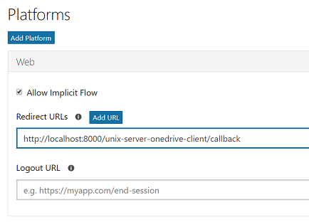

## Unix Server OneDrive Client


This application will allow you to automate uploading directories from a Unix-based server to your OneDrive cloud storage. The primary application of this is backup redundancy using your OneDrive service for critical directories such as a Git remote.

 |
------------ | 
_High level design_ | 

It takes a list of mappings of a directories on the server that are uploaded to the specified directory in OneDrive. The server directory is compressed into `.tar.gz` format before being uploaded. 

- create diagram showing mappings

This README is more of a guide and includes instructions on everything from setting up your Microsoft project, to setting up the Python application and setting up the cron jobs on your server.

It consists of the following parts:

- Using the Microsoft application registration portal to set up your OneDrive service API
- Setting up the Python application that implements the logic required to utilize the API
- Setting up the cronjobs that can be run on a Unix-based server to execute the Python application at a given interval

Note that this guide assumes you are using a Unix cron scheduler but theoretically you could run this from any machine as long as it has a scheduler and can run Python. In this case we would normally call this machine the 'server' but actually the way it's applied here it's more of a client from how it will be interacting with Microsoft's service API.

What you will need:
- A machine with a scheduler that can run Python - ideally with 24/7 availability
- Access to a Microsoft account for creating the application
- Access to the Microsoft account with OneDrive storage provisioned (this can be the same as the account used to create the application)

### Create Microsoft Application

In order to use Microsoft's services API which is referred to as Microsoft Graph, you will need to use your account to register an application. To do so, visit their application registration portal:

https://apps.dev.microsoft.com/

Once you've signed in, click on "Add an app". Give your app a name and click on "Create application".

 |
------------ | 
_Creating the Microsoft application_ |


First thing you want to do is generate a new application secret in password form. So click on "Generate New Password". Be sure to save the client secret! You'll eventually enter this in your configuration file as the `client_secret`.

 |
------------ | 
_Getting a client secret_ |

Next you're going to want to add your platform. We're going to authenticate in the browser so click on "Add Platform", then "Web"


 |
------------ | 
_Adding the web platform_ |

Add the following as the redirect URL: `http://localhost:8000/unix-server-onedrive-client/callback`.

 |
------------ | 
_Adding the redirect URL_ |

The default permissions work for the purposes of the app. Click on "Save" at the bottom to save your changes.

Before leaving, save your application ID. You'll enter this in the configuration file as the `client_id`.

 |
------------ | 
_Saving the application ID_ |

### Set up Python Application

#### Clone repository

Make sure you're in the directory where you want to run the Python application and Cronjob from. The rest of these steps will denote the current directory by `<path>`

```
$ git clone https://github.com/snxfz947/unix-server-onedrive-client.git
```

Alternatively, if you want to use SSH:

```
$ git clone git@github.com:snxfz947/unix-server-onedrive-client.git
```

#### Install relevant tools

To run the Python application you will need to install Python as well as some dependencies.

##### Python

The steps you take to install Python largely depends on the OS or distribution you're using. Chances are you already have Python installed or it was there by default. **The most important thing is that you have Python 3** (not Python 2). You will also need [pip](https://en.wikipedia.org/wiki/Pip_(package_manager)) for Python 3. Here are the steps for installing from the Python docs:

https://docs.python-guide.org/starting/install3/linux/

If you decided to go with Ubuntu 18.04 server, Python 3 is already installed but pip can be installed using the following:

```
$ sudo apt-get install python3-pip
``` 

Check your Python version using the `-V` argument:

```
$ python3 -V
Python 3.6.5
```

Note that for the particular Ubuntu server version `python3` is used to invoke Python 3, `python` runs Python 2. Similarly for pip, `pip3` is used to invoke the package manager for Python 3.

Check that `pip3` is set up correctly:

```
$ pip3 -V
pip 9.0.1 from /usr/lib/python3/dist-packages (python 3.6)
```

##### Dependencies

Run the following to install the necessary Python packages:

```
$ pip3 install filesplit requests
```

Run the following (on Ubuntu at least) to install `jq`:

```
$ sudo apt install jq
```

#### Complete configuration JSON

For running the app, the only configuration file that needs to be modified is the `user_config.json` file. `dev_config.json` contains all the configuration values that would be modified for development purposes only. 

##### Required fields

* `client_id` - you should have this from the `Create Microsoft Application` section
* `client_secret` - you should also have this from the `Create Microsoft Application` section
* `backup_max_size` - this is the maxiumum size for all OneDrive upload directories. This means if a directory reaches this limit, the oldest files will be deleted to maintain the size. It is set by default to 5 GB - change this to the desired size.
* `upload_partition_limit` - this should be left alone
* `upload_pairs` - these are the mappings for the directory on your server that will be uploaded in `.tar.gz` format to the directory in your OneDrive storage. It is an array so you can add as many mappings as you wish. The array expects objects with a `local_dir` string property which should be an absolute path specifying the directory on the server that will be backed up, and `server_dir` string property which should be an absolute path specifying the directory in your OneDrive storage in which the tar will be placed.
```
    [
        {
            "local_dir": "/absolute/path/to/directory/on/server"
            "server_dir" "absolute/path/to/directory/in/OneDrive/storage"
        },
        {
            "local_dir": "/another/absolute/path/to/directory/on/server"
            "server_dir" "another/absolute/path/to/directory/in/OneDrive/storage"
        },
        ...
    ]
```
This can be a many-to-many mapping, meaning you can backup the same directory to multiple OneDrive directories, and vice-versa - you can backup multiple directories to the same OneDrive directory. 
* `verbosity` - turn on `verbose` to see more log output. `debug` is more for development purposes.

#### Configure token

We will now use our credentials to get our API token for sending requests to our application.

Run the `config` script:

```
$ cd <path>/unix-server-onedrive-client
$ ./config
```

### Using the App

#### Running for the First Time

#### Viewing Logs

To see the logs, open `<path>/unix-server-onedrive-client/output.txt` This can be done by running:

```
$ cat <path>/unix-server-onedrive-client/output.txt
```

 |
------------ | 
_Viewing the logs_ |

Here you can see that the cronjob detected that the app was not running, so it started it up. This is indicated by the `CRONJOB:` tag. You can also see that `receive` has started, and `send` has sent it's first message.

#### Clearing Logs

To clear the logs, run:

```
$ cd <path>/unix-server-onedrive-client
$ ./clear
```

### Scheduling Runs Using Cron